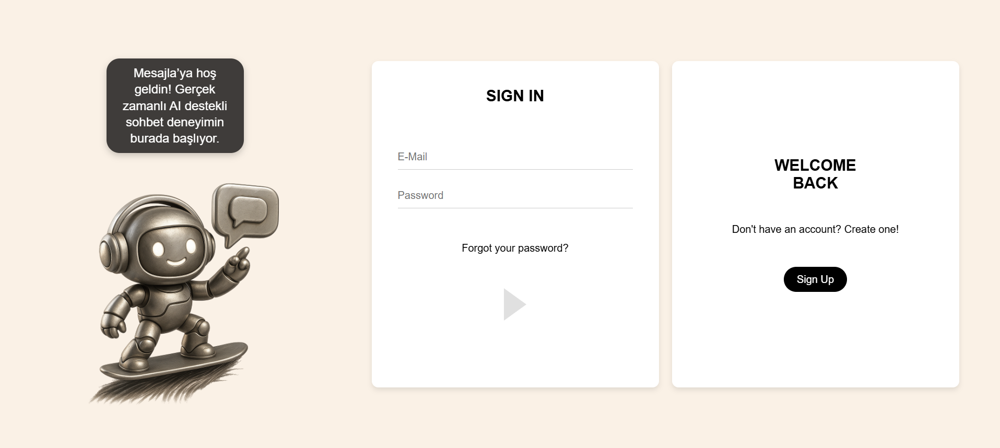
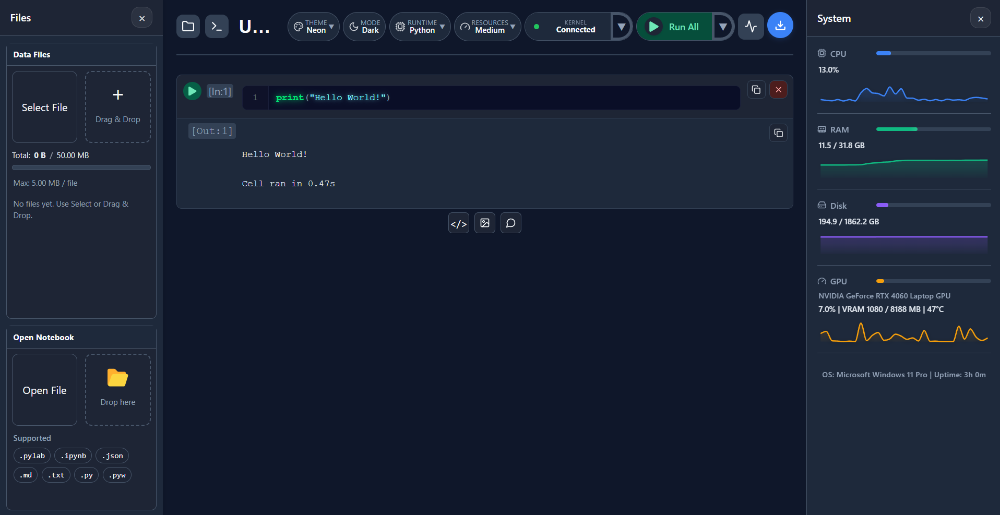

  

# 👋 Hi, I'm Serdar Kemal Topkaya  

 Software Engineer  Full Stack Developer | Machine Learning &amp; AI Enthusiast 

<!--

<h1 align="center">👋 Hi, I'm Serdar Kemal Topkaya</h1>

  Software Engineer 
  Full Stack Developer | Machine Learning &amp; AI Enthusiast

-->

## About Me

I enjoy:
- Solving complex problems and writing efficient algorithms  
- Creating full-stack web applications  
- Exploring AI, machine learning, and deep learning technologies  
- Continuously learning and building impactful projects  

> You can also explore my work in more detail on my personal portfolio website:  
> **👉 [Visit my portfolio](https://serdarkemaltopkaya.vercel.app/)**

## Connect With Me

## Technical Skills

**Languages**

**Frontend**

**Backend**

**Machine Learning & Data**

**Databases**

**DevOps & OS**

## Latest Project

<!--

### [Mesajla - Real Time Chatting Application](https://github.com/SKT1803/mesajla-real-time-ai-powered-chat-application)
Real time chatting application where you can choose your reply to your contact's message with one of the ai generated options if you want. 

<table>
  <tr>
    <td>
       <h3>Tech:</h3>
    <ul>
        <li>React</li>
        <li>Python</li>
        <li>Flask</li>
        <li>Pytorch</li>
        <li>MongoDB</li>
        <li>Firebase</li>
      </ul>
     </td>
  <td></td>    
  </tr>
  
</table>
-->

### [PyLab - A Modern Desktop Python Notebook IDE](https://pylab-desktop.vercel.app/) 
Lightweight notebook-style Python runner for Python learning and data science, allowing users to write code cells, add Markdown comments and images, upload files, and execute code inside isolated Docker containers with real-time output streaming. Also available as a desktop application.

**Download / Setup:** [Setup Link](https://github.com/SKT1803/pylab-installer/releases/tag/pylab-v1.1.1)

<table>
  <tr>
    <td>
      <h3>Tech:</h3>
      <ul>
        <li>React</li>
        <li>Electron</li>
        <li>Go</li>
        <li>Gin</li>
        <li>Docker</li>
        <li>WebSockets</li>
      </ul>
    </td>
    <td></td>
  </tr>
</table>

<!--
## 📈 GitHub Stats

-->

